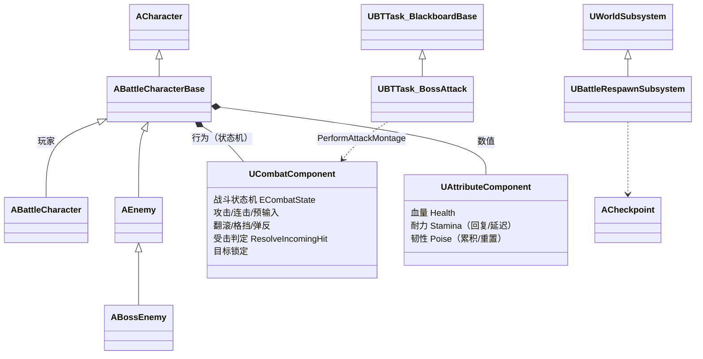
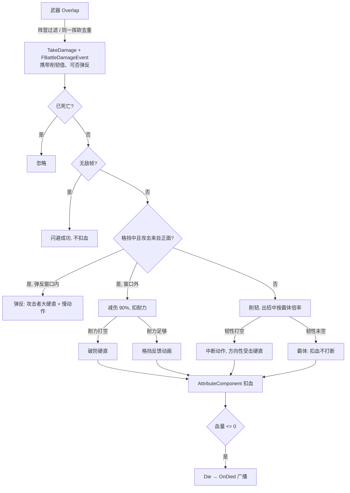
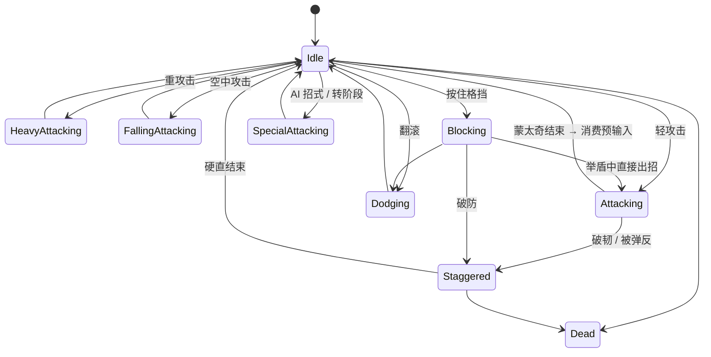

# Battle —— UE5 类魂战斗 Demo

基于 **Unreal Engine 5.5 + C++** 实现的第三人称类魂（Souls-like）近战战斗 Demo。
核心战斗逻辑全部由 C++ 实现，蓝图只负责资源配置（蒙太奇、数值、行为树结构）。

> 演示视频：`TODO: 在此放置视频 / GIF 链接`

---

## 操作

| 操作 | 键鼠 | 手柄 |
|---|---|---|
| 移动 / 视角 | WASD / 鼠标 | 左摇杆 / 右摇杆 |
| 轻攻击（连击） | 鼠标左键 | — |
| 重攻击 | Shift + 鼠标左键 | — |
| 翻滚（无方向输入时为后撤步） | `TODO` | — |
| 格挡（按下瞬间为弹反窗口） | 鼠标右键 | LB |
| 锁定 / 解锁目标 | 鼠标中键 | — |
| 切换锁定目标 | 锁定状态下左右甩动视角 | 右摇杆 |
| 跳跃（空中攻击 = 下落攻击） | 空格 | A |

---

## 功能一览

- **连击与预输入**：三段连击，每段分为 起手 / 连击窗口 / 预输入窗口 三个阶段；支持跨动作预输入（攻击中预输入翻滚等）
- **翻滚**：四向翻滚 + 后撤步，动画通知驱动无敌帧
- **耐力**：攻击、翻滚、格挡消耗耐力；出招期间暂停回复，停手后延迟回复；耐力 > 0 即可出招（类魂规则）
- **韧性 / 霸体**：受击累积削韧，韧性打空才硬直；Boss 出招期间只承受 30% 削韧
- **格挡 / 弹反**：正面 70° 内可格挡，减伤 90% 并按伤害扣耐力，耐力打空破防；举盾 0.2 秒内被击中触发弹反，攻击者进入大硬直且下一击伤害 ×2，伴随慢动作
- **方向性受击**：根据攻击来源播放前 / 后 / 左 / 右受击动画
- **打击感**：攻击者局部顿帧（Hit Lag，只降低攻击者蒙太奇速率）+ 镜头震动
- **目标锁定**：视角夹角优先选择、左右切换、遮挡延迟解锁、超距 / 目标死亡自动解锁
- **Boss 战**：底部 Boss 血条（带延迟掉血条）、50% 血量进入二阶段（无敌转阶段动作，之后出招 / 移动加速）、C++ 行为树任务按 距离 + 阶段 + 权重 选招
- **死亡与重生**：YOU DIED 界面 → 重置敌人（Boss 击杀后永久死亡）→ 在最近激活的检查点重生
- **调试可视化**：控制台 `Battle.Debug 1/2` 显示所有角色的战斗状态、属性、格挡角度与武器判定框

---

## 架构

### 类关系



设计原则：

- **组件化**：`UAttributeComponent` 只管数值，`UCombatComponent` 只管行为，二者玩家和敌人通用；角色类只负责输入、UI、AI 等差异部分
- **数据驱动**：蒙太奇、伤害倍率、削韧值、耐力消耗、Boss 招式表全部是 `UPROPERTY`，在蓝图中配置
- **动画驱动逻辑**：伤害判定窗口、无敌帧、连击窗口、预输入窗口均由动画通知控制，逻辑与动画帧严格对齐

### 受伤流程



### 战斗状态机



所有"动作结束"都走统一出口 `ReturnToIdle()`：回到 Idle → 执行缓存的预输入 → 若格挡键仍按住则自动举盾。

---

## 技术要点

### 1. 连击三阶段 + 跨动作预输入
每段攻击由两个蒙太奇通知切分为 `Startup → Combo → Buffer`：
- **Combo 窗口**内按攻击：用 `Montage_SetNextSection` 把当前段链接到下一段，当前段自然播完后无缝衔接
- **Buffer 窗口**内的任意输入（攻击 / 重攻击 / 翻滚）被缓存，蒙太奇结束时在 `ReturnToIdle` 中执行
- 状态切换使用**白名单**（只有 Idle 允许发起新动作），新增状态默认不可打断

### 2. 蒙太奇回调的正确性
- `OnPlayMontageNotifyBegin` 是 AnimInstance 级多播，所有蒙太奇的通知都会进入；每个回调都用 `BranchingPointPayload.SequenceAsset` 过滤来源
- 连续受击时新蒙太奇会打断旧实例，旧实例的 End 回调仍会触发：通过记录 `CurrentStaggerMontage` + 检查 `Montage_IsPlaying` 过滤掉过期回调，避免错误地回到 Idle

### 3. 自定义伤害事件
`FBattleDamageEvent` 继承 `FDamageEvent`（与引擎 `FPointDamageEvent` 相同的 ClassID 机制），携带削韧值与可否弹反 / 格挡。受伤方通过 `IsOfType` 识别；环境伤害等普通 `FDamageEvent` 按默认规则处理，保持与引擎伤害管线兼容。

### 4. 韧性与霸体
`ApplyPoiseDamage` 累积削韧，打空才触发硬直并立即回满；一段时间未受击自动回满。出招期间削韧乘以 `AttackingPoiseDamageScale`，Boss 设为 0.3 即实现"出招霸体"。

### 5. 弹反
格挡开始时间 + `ParryWindow` 判定。弹反成功调用攻击者的 `ReceiveParried`，进入大硬直并标记 `bIsParryStunned`，下一次受击伤害 ×2 且不可格挡。慢动作使用全局时间膨胀，定时器时长按膨胀系数换算，并在 `EndPlay` / 死亡时强制恢复，防止角色销毁导致游戏卡在慢动作。

### 6. 局部顿帧（Hit Lag）
命中时只降低**攻击者**当前蒙太奇的播放速率（而非全局时间膨胀），受击者与其他角色不受影响；恢复时回到 `ActionPlayRate`，与 Boss 二阶段加速兼容。

### 7. Boss AI
`UBTTask_BossAttack`（C++ 行为树任务）：
- 按 距离区间 + 阶段区间 过滤招式，再按权重随机，刚用过的招式权重减半避免重复
- 出招前段持续转向目标（追踪），之后锁定方向给玩家闪避空间
- 任务持续到 Boss 回到 Idle（包括被打出硬直），期间行为树不会驱动移动
- 节点内存通过 `InitializeMemory` 显式构造

### 8. 重生系统
`UBattleRespawnSubsystem`（World Subsystem，零配置）：敌人首次 `BeginPlay` 时记录类与出生点；玩家死亡后销毁并重新生成所有敌人（行为树、血量、位置完全重置），`bRespawnAfterDeath = false` 的 Boss 被击杀后不再生成。玩家通过 `GameMode::RestartPlayerAtTransform` 在检查点重生，HUD 监听 `OnPossessedPawnChanged` 自动重新绑定新 Pawn。

---

## 调试

PIE 中按 `~` 打开控制台：

| 命令 | 效果 |
|---|---|
| `Battle.Debug 1` | 所有角色头顶显示：战斗状态、攻击阶段、HP / 耐力 / 韧性、无敌帧 / 被弹反 / 预输入标记 |
| `Battle.Debug 2` | 额外绘制格挡角度扇形、武器判定框（仅判定窗口内） |
| `Battle.Debug 0` | 关闭 |

---

## 目录结构

```
Source/Battle/
├── Character/     ABattleCharacterBase（公共受伤/死亡）、ABattleCharacter（玩家输入/摄像机）
├── Component/     UCombatComponent（战斗行为）、UAttributeComponent（血量/耐力/韧性）
├── Enemy/         AEnemy（普通敌人）、ABossEnemy（阶段/血条/开战）
├── AI/            UBTTask_BossAttack（Boss 选招行为树任务）
├── Game/          UBattleRespawnSubsystem（死亡重生）、ACheckpoint（检查点）
├── AnimNotify/    伤害判定窗口、无敌帧窗口
├── Types/         状态枚举、FBattleDamageEvent
└── UI/            HUD、玩家血条/耐力条、敌人头顶血条、Boss 血条、死亡界面
```

---

## 运行环境

- Unreal Engine 5.5
- Visual Studio 2022（C++ 游戏开发工作负载）
- 大资源通过 Git LFS 管理，克隆后执行 `git lfs pull`

打开 `Battle.uproject`，首次打开会提示编译模块，选择"是"。默认地图：`/Game/ThirdPerson/Maps/LandscapeExample`。

---

## 已知问题与后续计划

- [ ] 格挡动画目前为全身动画，移动时下半身不播放走路；计划在动画蓝图中加入上半身分层（Layered Blend per Bone）
- [ ] 重攻击通过检测 LeftShift 实现，计划改为独立的 Enhanced Input 动作以支持手柄
- [ ] `UCombatComponent` 职责较多，计划拆分出独立的 `UTargetLockComponent`
- [ ] 武器判定为 Box Overlap，低帧率下快速挥砍可能漏判，计划改为逐帧 Sweep
- [ ] 普通敌人 AI 仍为蓝图任务，计划迁移到 C++ 并接入 AI Perception
